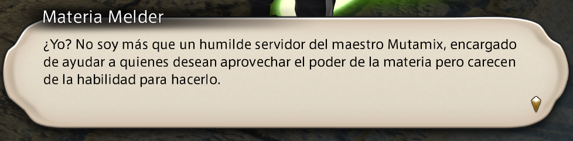

# Gubal Library

*Community language localizer for FFXIV.*

Final Fantasy XIV speaks four languages. Its players speak dozens.

Every one of those communities has had the same thought at some point: *we could translate this
ourselves.* What stopped them was never the will, and never the words — it was that there was nowhere
to put them. Gubal Library is that place. It takes a language pack the community built and gives it
to the game: the game's own font, the game's own typewriter reveal, the game's own line breaks,
formatting intact.

Named for the Great Gubal Library, Sharlayan's repository of all written knowledge — which is what a
language pack is: a library of the game's words in a language it was never given.

A Dalamud plugin that hands the game pre-translated copies of its own text files. The game keeps its
text in Excel sheets inside its archives; this points its reads at rebuilt copies on your disk and
gets out of the way. Any language works: the pack declares its own, and nothing in the plugin knows
or cares which one it is. **Your game install is never modified** — the archives are untouched and a
game patch overwrites nothing.

**This project does not distribute language packs.** Users either find a pack the community has
published for their language or build their own — which is why
[LANGUAGE-PACK.md](LANGUAGE-PACK.md) documents the format in full rather than sketching it.

**So it ships empty**, and the documentation says so first, before anything else. Installing it
changes nothing until a language pack is installed.

- **Want to build a language pack for your language?** → [LANGUAGE-PACK.md](LANGUAGE-PACK.md)

## Examples

The live game with a Spanish language pack installed. None of it is a mock-up or an overlay: the game
read those words out of a file and drew them itself.




## Install

A testing build, so expect rough edges. It needs XIVLauncher/Dalamud.

1. **Add the repository.** `/xlsettings` → **Experimental** → paste the URL into an empty
   **Custom Plugin Repositories** box, press **+**, tick *Enabled*, then **Save and Close**:

   ```
   https://raw.githubusercontent.com/ashdam/gubal-library/main/repo.json
   ```

2. **Install the plugin.** `/xlplugins` → search for **Gubal Library** → **Install**.

3. **Install a language pack.** The step that actually matters — everything in the game stays as it
   was until you do. `/gubal` → put a link, a `.zip` or an already-unpacked folder in *Language pack*
   → **Install**. Nothing is downloaded until you press it.

4. **Restart the client.** Not optional, and not a rough edge: the game reads its text once, a couple
   of seconds into startup, and keeps it for the whole session. A pack switched on mid-game changes
   nothing until the next start.

The settings window then names the pack, its version and its author, and reports **how many reads it
has actually answered**. That last number is the one to look at: a pack that is loaded but never read
looks identical to a working one on every other indicator.

**Staying current.** The plugin asks the address inside your pack whether a newer one is published —
a couple of kilobytes, once, each time it loads — and says so in chat when you log in. Nothing is
downloaded unless you press **Update**. The settings window has a **Check for updates** button, and
`/gubal check` does the same from chat, for when a pack is published while you are already playing.

**Fetching it by itself.** Tick *Fetch a newer pack while the game starts* and you never press
anything: the check, the download and the install all happen during startup, **before** the game
reads its text, so the newer translation is live in that same session and there is nothing to
restart. It holds the game's start while it downloads, which is why ticking it also turns on
Dalamud's *wait for plugins before game loads* — without that the client would read its text
mid-download and the session would come out untranslated, so the plugin checks and declines rather
than risking it. Off by default, and only offered for a pack installed from a link, since a pack
taken from a file has no address to ask. Unticking it leaves Dalamud's setting where it is — that one
is yours, and it lives in `/xlsettings`.

**Reporting a problem.** Open an [issue](https://github.com/ashdam/gubal-library/issues) with what you
expected and what you got (a screenshot beats a description) and the output of `/gubal status`. If the
game closed, add the most recent `crash-<date>.tspack` from `%AppData%\XIVLauncher\`.

If a line is simply not translated, that is the pack rather than the plugin — take it to whoever
maintains it.

**Uninstalling.** `/xlplugins` → **Gubal Library** → **Uninstall**. To drop the repository too,
`/xlsettings` → **Experimental** → the bin icon on that URL's row.

## What gets translated

Whatever the pack covers, and there is no list of supported windows — which is the point of doing it
this way. Dialogue, quest journal, cutscene subtitles, speech balloons, menus, item names, tooltips
and log messages all come out of the game's Excel sheets, so all of them are reached. Italics, colour
and gender agreement survive, and the engine does its own layout.

Two things do not work this way, and both are inherent:

**The game has no slot for most languages.** It knows Japanese, English, German and French, so a pack
replaces one of them — usually English. The language it replaced is gone while the pack is on.

**Pages are built for one patch.** When the game updates, the pack must be rebuilt. Until it is, the
plugin refuses to serve it and says so, because serving the previous patch's text would put it on the
wrong rows silently. This is the day the startup fetch above earns its keep: if the pack has already
been rebuilt, the client takes it while it boots and the patch costs you nothing.

## On the network

**Nothing is ever sent anywhere.** No telemetry, no analytics, nothing about you or your character,
and nothing is translated at runtime.

The only outgoing requests are to the pack address *you* typed in: downloading it when you press
Install, and afterwards a small check of whether a newer one has been published, if the pack says
where to look. That address is also the only one a download can ever come from — including the
startup fetch, which is off until you turn it on and goes nowhere you did not name. Point the plugin
at a local zip or a folder and it never touches the network at all.

## Commands

| Command | Effect |
|---|---|
| `/gubal` | Open the settings window |
| `/gubal status` | The installed pack, its version, coverage, and how many reads have been answered this session |
| `/gubal check` | Ask now whether a newer language pack is published, and say either way |
| `/gubal usepack` | Turn the pack on or off from the next start — a way back when the settings window is not reachable |
| `/gubal autoupdate` | Turn the startup fetch on or off, along with Dalamud's wait for plugins |
| `/gubal probesqpack` | Diagnostic: log every Excel page the game reads, redirecting nothing |

`probesqpack` attaches when the plugin loads and only then, so it takes effect at the next client
start. It exists to check that the plugin still attaches before the game's first read, which is the
one property this whole approach depends on.
