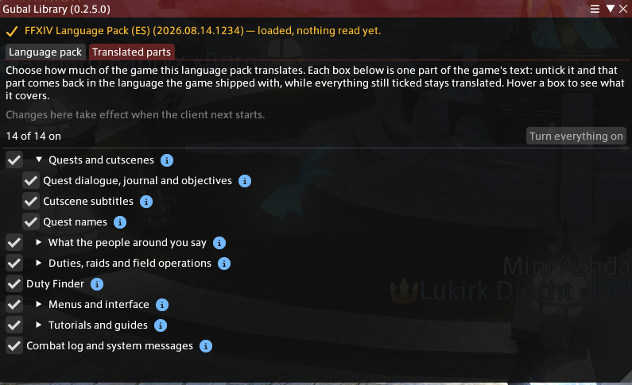
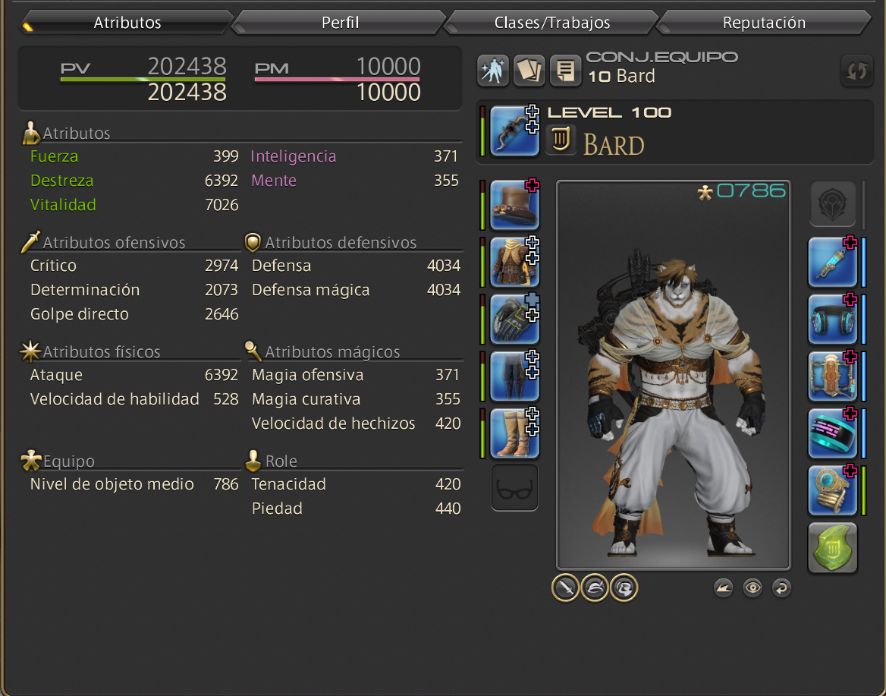

# Gubal Library

*Community language localizer for FFXIV.*

A Dalamud plugin that hands the game pre-translated copies of its own text files. The game draws them
itself, with its own font, its own typewriter reveal and its own line breaks, so italics, colour and
gender agreement all survive. **Your game install is never modified.**

Named for the Great Gubal Library, Sharlayan's repository of all written knowledge.

The plugin lists the packs the community publishes, and downloads the one you pick from the address its own maintainers gave. Any language works.

Want to build a pack for your language? → **[LANGUAGE-PACK.md](LANGUAGE-PACK.md)**

## Language packs


| Language | Pack | Github Releases | Support |
|---|---|---| --- |
| Español | [Eorzea en español](https://eorzea-in-spanish.ashdam.workers.dev/) | [Releases](https://github.com/ashdam/ffxiv-language-pack-es/releases) | [Issues](https://github.com/ashdam/ffxiv-language-pack-es/issues) |
| Italiano | none published yet | — |
| Português | none published yet | — |
| Any other | [build one](LANGUAGE-PACK.md) | — |

**Want yours on that list?**. Start at [LANGUAGE-PACK.md](LANGUAGE-PACK.md) and ask on
[Discussions](https://github.com/ashdam/gubal-library/discussions).
## Examples

The live game with a Spanish pack installed. Not a mock-up and not an overlay: the game read those
words out of a file and drew them natively.






## Install

Gubal-library is a Dalamud plugin therefore Dalamud needs to be [downloaded](https://goatcorp.github.io/) and installed .

**In Dalamud:**

1. **Add gubal-library repository.** Go to Dalamud settings or write `/xlsettings` in the chat then go to **Experimental**. Go to **Custom Plugin Repositories** box, press **+**, tick *Enabled*, **Save and Close**:

   ```
   https://raw.githubusercontent.com/ashdam/gubal-library/main/repo.json
   ```

2. **Install the plugin.** `/xlplugins` → search **Gubal Library** → **Install**.

3. **Install a language pack.** Open Gubal or write `/gubal` in the chat → pick yours under *Language* → **Install**. Building one
   yourself? Pick *a pack of your own* and point it at your build folder; nothing is copied.

4. **Restart the client.** Not optional: the game reads its text once, seconds into startup, and
   keeps it for the session. A pack switched on mid-game changes nothing until the next start.

**Keep your language pack updated.** The plugin keeps your language pack update when a newer one exists. You can also configure the auto-update feature to save a restart whenever there is an update.


## What gets translated

Whatever the pack covers, and there is no list of supported windows — that is the point of doing it
this way. Dialogue, quest journal, cutscene subtitles, speech balloons, menus, item names, tooltips
and log messages all come out of the game's Excel sheets, so all of them are reached.

**You can turn parts of it off.** The *Translated parts* tab lists what the installed pack holds,
with a checkbox each and a note on what switching it off costs. Switching a part off does not blank
it: the pack replaces the game's own English, so that English is what comes back.

## How this compares

| | Well-known plugin<br><sub>translated as it appears, drawn over the game</sub> | Mod-loader text packs<br><sub>the game's pages, applied by a mod loader</sub> | **Gubal Library**<br><sub>the game's pages, served by the plugin</sub> |
|---|:---:|:---:|:---:|
| **What else you must install** | a translation service,<br>usually with an API key | mod loader (Penumbra) | ✅ **nothing** |
| **The game lays the text out** | ❌ drawn on top | ✅ Native | ✅ Native |
| **Gender and number agree** | ❌ not considered | ✅ Native | ✅ Native |
| **Network traffic while you play** | ❌ every line | ✅ none | ✅ none |
| **Consistent from one line to the next** | ❌ each line alone | ✅ | ✅ glossary, enforced by a validator |
| **Choose what stays in English** | ➖ | ✅ by category | ✅ by category/subcategory |
| **Your game files untouched** | ✅ | ✅ | ✅ |


## Commands

The last three take no argument: each one flips what it names.

| Command | Effect |
|---|---|
| `/gubal` | Open the settings window |
| `/gubal status` | The installed pack, its version, coverage, and reads answered this session |
| `/gubal parts` | Which parts of the translation are switched on, by group |
| `/gubal check` | Ask now whether a newer pack is published, and say either way |
| `/gubal usepack` | Toggle: the pack or the game's own English, from the next start. The way back when the settings window cannot be reached |
| `/gubal autoupdate` | Toggle: the startup fetch, along with Dalamud's wait for plugins |
| `/gubal probesqpack` | Toggle: log every Excel page the game reads, redirecting nothing. Chat only, there is no checkbox |

`probesqpack` attaches when the plugin loads and only then, so it takes effect at the next client
start. It exists to check that the plugin still attaches before the game's first read, which is the
one property this whole approach depends on.

## Contributors

- **Mini Ashdam** — [Lodestone profile](https://eu.finalfantasyxiv.com/lodestone/character/1580162/)
- **Nier Gainsborough** — [Lodestone profile](https://eu.finalfantasyxiv.com/lodestone/character/30057928/)
- **Lfay Yette** — [Lodestone profile](https://eu.finalfantasyxiv.com/lodestone/character/20396696/)
